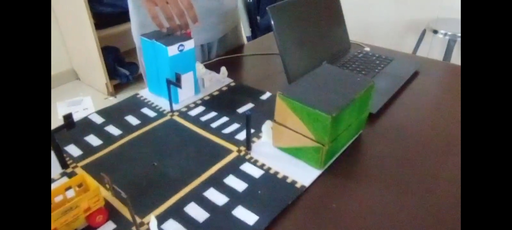
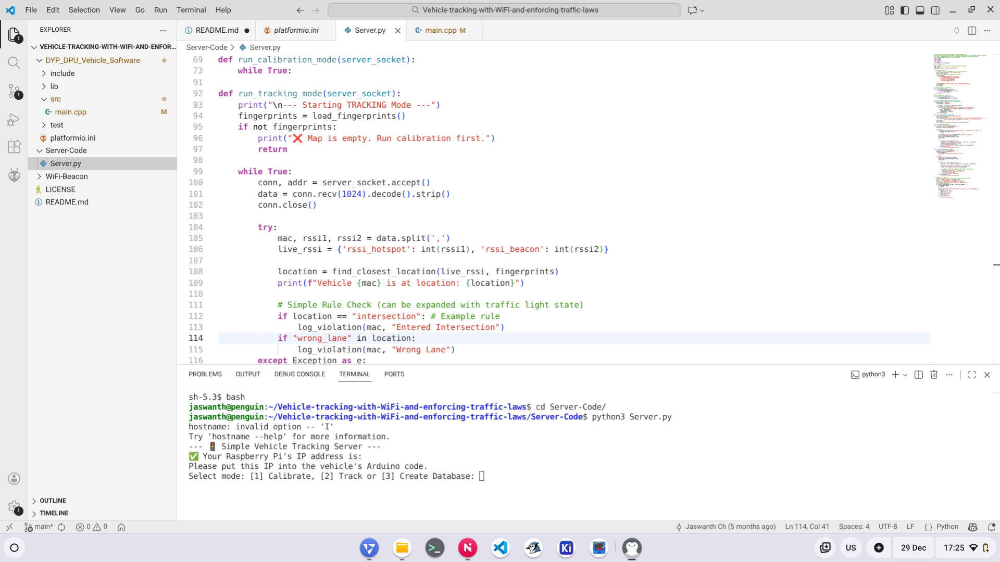

# Vehicle-tracking-with-WiFi-and-enforcing-traffic-laws
This project allows you to detect the location of a vehicle using the wifi signals around it. This project was created to participate in D.Y. Patil DPU Inter school fest 2025 in the Future transportation design(model) category for class IX and X students and has won first prize.



<br>


## Why do we need to track vehicles using WiFi instead of GPS
While GPS is a good choice for tracking vehicles it faces issues in densly populated urban areas where the GPS signals bounce on the surfaces of buildings and tall skyscrapers before reaching the satelite this causes a latency and gives innacurate readings, this phenomenon is called as urban canyon effect. To combat this issue we will track vehicles with WiFi and also detect is any vehicle is breaking any traffic laws. WiFi chips are also getting cheaper, efficient and can be integrated easily into vehicles and OEMs can sell kits which will allow consumers to use this technology with ease. Infrastructure for WiFi access points can easily be installed and maintained and costs less than sending a satellite to space, we can even repurpose old computers as WiFi access points. WiFi based tracking wont replace GPS but it will be an extension of it.

## How does it work
This project uses RSSI fingerprinting where we initially have to calibrate and create a map for places like intersection, footpath,etc. After calibrating the vehicle will start scanning for networks around it and sends the signal strength of the networks to the server which will then determine the location of the vehicle and see if it is breaking any traffic rules or not, if the vehicle breaks any traffic rules then the server detects it and stores it in a database.

## What do you need
1. ESP8266 (For the vehicle)
2. 2 WiFi access points (Wifi router, Phone/Laptop, any other microcontroller)
3. Server (Raspberry Pi, SBC, Laptop/Desktop)

## Setup
1. Setup the WiFi beacons using phone hotspot, WiFi routers or any other WiFi based MCU, 2 beacons are required but you can modify the code for 3 beacons for better accuracy. Place the beacons on the corners of the map.
2. The server code can be run on any computer, for this project I'm using a raspberry pi zero w, run the ```Server.py``` from the ```Server-Code``` folder and copy the IP adress of the server and paste it in the code for the vehicle in ```DYP_DPU_Vehicle_Software/src/main.cpp``` on line ```const char* serverIP = "192.168.x.x";```
3. Edit the lines ```const char* hotspot_ssid = "Beacon_A";``` and ```const char* hotspot_password = "passwd@123";```, replace ```Beacon_A``` with the name of the network to which your server is connected and change ```passwd@123``` to the network password to which your server is connected
4. Change the board settings in the ```DYP_DPU_Vehicle_Software/platformio.ini``` if you're not using Wemos-D1-R1
5. Upload the code to the ESP8266 using platformio IDE

## Usage
Start the server by running the ```Server-Code/Server.py``` script and select mode 3 and create a database then select mode 1 and create the map, currently 2 locations can be mapped intersection and wrong lane, after mapping select mode 2 to start tracking the location of the car.

<br>


